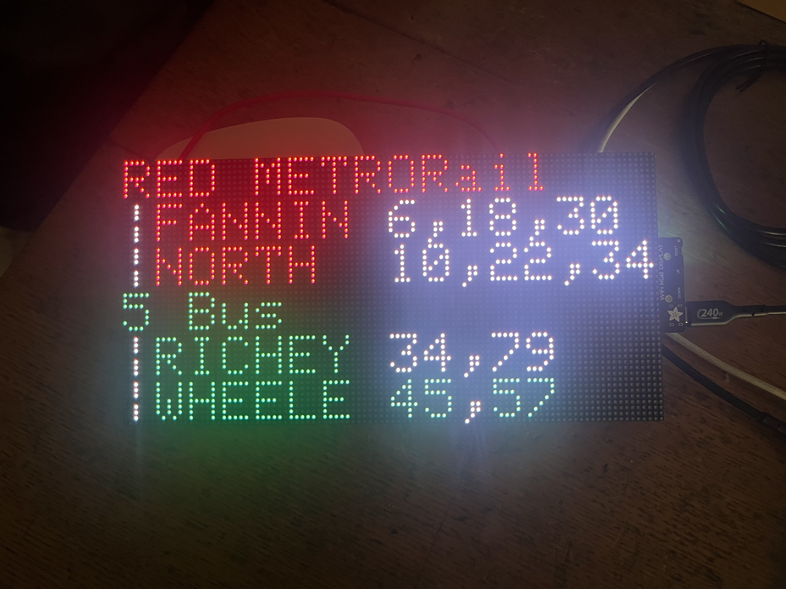

Web service and firmware for LED transit time sign.

A wedding gift powered by the [Transit App API](https://api-doc.transitapp.com/v3.html).

## Features

- Live and scheduled nearby departure times displayed on the LED matrix panel.
- Website to submit wedding wishes to be displayed periodically on the device.

## How-to

### Upload firmware

Create a device configuration profile based on in `firmware/profiles/`, using
[`example.json`](firmware/profiles/example.json) as a reference.

```
$ make upload PROFILE=example
```

### Deploy

[Merges to master](.github/workflows/deploy-dev.yml) automatically deploy the backend and frontend to dev.

Manually run
[the prod workflow](https://github.com/gusostow/foamer-eta/actions/workflows/deploy-prod.yml) to
deploy to prod.

## Details

### Components

- Display - [RGB-Matrix-P2.5-96x48-F](https://www.waveshare.com/wiki/RGB-Matrix-P2.5-96x48-F)
- Board - [Adafruit MatrixPortal S3](https://learn.adafruit.com/adafruit-matrixportal-s3)

### Firmware

Uses https://github.com/mrcodetastic/ESP32-HUB75-MatrixPanel-DMA to drive the panel.

Embedded development with PlatformIO.

### Backend

Written in Rust. Axum webserver deployed to AWS Lambda.

Static frontend served from S3.

IaC via AWS CDK.
